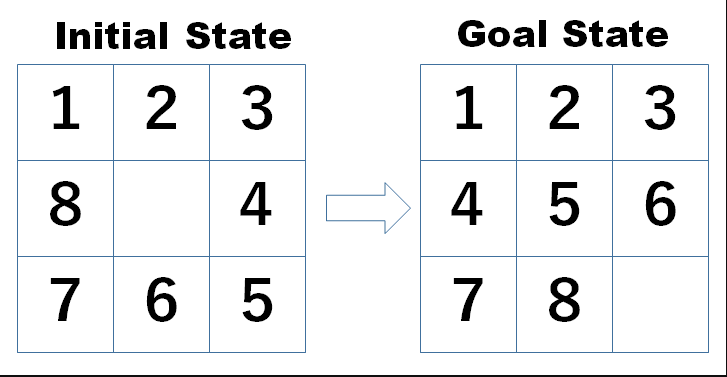

# 8 Puzzle Game in Java

## Introduction

This project was a case study to apply object-oriented methodologies to architect the software in an organized and reusable manner.  
Using technologies and libraries such as Junit, Mockito, JDBC, PostgreSQL and Swing to create serialization of game state and the graphical interface.

## About the Game

The 8 Puzzle Game, also known as the sliding puzzle, is a classic puzzle game consisting of a 3×3 grid with eight numbered tiles and one space (0). Players solve the puzzle by sliding tiles into the space (0) to arrange them in numerical order from 1 to 8. This project implements a complete solution with a user-friendly graphical interface, persistent storage capabilities, and multiplayer support through player profiles and saved game states.

## Objectives

- Apply object-oriented concepts to build software, such as:
  - Abstraction
  - Encapsulation
  - Composition
  - Inheritance
  - Polymorphism

- Create a test-driven development (TDD) oriented project.
- Keep the code clean without bad smells, with semantic naming of classes, methods, and attributes.
- Implement independent MVC layers.
- Use design patterns.
- Persist the game state in a PostgreSQL database.

## Technologies
- **Java:** the primary programming language for the application.  
- **JDBC:** for database connectivity and executing SQL queries.  
- **PostgreSQL:** relational database for storing game states and player profiles.  
- **Maven:** project build and dependency management.  
- **JUnit:** testing frameworks for unit and integration tests.  
- **Swing:** for building the graphical user interface.  
