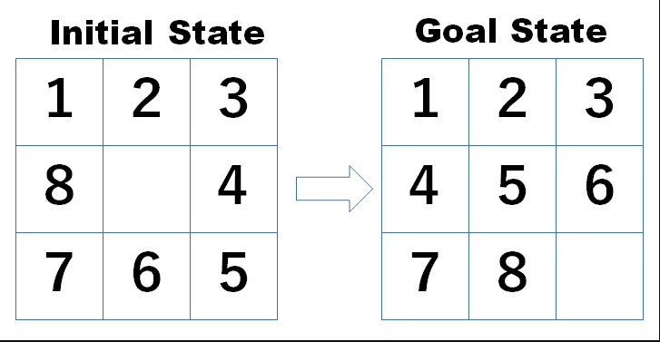

# 8 Puzzle Game in Java


## Introduction

This project was a case study to apply object-oriented methodologies to architect the software in an organized and reusable manner.  
Using technologies and libraries such as JUnit, Mockito, JPA/Hibernate, PostgreSQL (Supabase) and Swing to create serialization of game state and the graphical interface.

## About the Game



The 8 Puzzle Game, also known as the sliding puzzle, is a classic puzzle game consisting of a 3×3 grid with eight numbered tiles and one space (0). Players solve the puzzle by sliding tiles into the space (0) to arrange them in numerical order from 1 to 8. This project implements a complete solution with a user-friendly graphical interface, persistent storage capabilities, and multiplayer support through player profiles and saved game states.

## Objectives

- Apply object-oriented concepts to build software, such as:
  - Abstraction
  - Encapsulation
  - Composition
  - Inheritance
  - Polymorphism

- Create a test-driven development (TDD) oriented project.
- Keep the code clean without bad smells, with semantic naming of classes, methods, and attributes.
- Implement independent MVC layers.
- Use design patterns (Observer, DAO, MVC).
- Persist the game state in a PostgreSQL database hosted on Supabase.

## Technologies

- **Java 11:** the primary programming language for the application.  
- **JPA / Hibernate 5.6:** ORM framework for database persistence, replacing raw JDBC.  
- **PostgreSQL (Supabase):** cloud-hosted relational database for storing game states and player profiles.  
- **Maven:** project build and dependency management.  
- **JUnit 5 / Mockito:** testing frameworks for unit and integration tests.  
- **H2 Database:** in-memory database used for running tests without external dependencies.  
- **Swing:** for building the graphical user interface.  

## Architecture

The project follows the **MVC (Model-View-Controller)** pattern with a layered architecture:

```
View Layer (Swing)
    └── MainWindow, BoardView, ControlView, Buttons
                    ↓
Controller Layer
    └── BoardController
                    ↓
Model Layer
    ├── Entities:      Board (@Entity), Player (@Entity)
    ├── Value Objects: Tile (in-memory game logic, not persisted)
    ├── DAOs:          BoardDAO, PlayerDAO, SaveNewGameDAO
    ├── Persistence:   PersistenceManager (EntityManagerFactory singleton)
    └── Interfaces:    BoardObserver (Observer pattern)
```

### JPA Entity Mapping

**Board** (`@Entity`, `@Table(name = "board")`)
- Uses `@Access(AccessType.PROPERTY)` — JPA reads/writes via getter/setter methods.
- The 9 tile values are mapped to `@Column` on the getters (e.g., `getTileTopLeft()` → `tile_top_left`).
- Game-logic fields (`Tile` objects, `pointer`, `observers`) are marked `@Transient` — they exist only in memory.
- The no-arg constructor calls `generateTiles()`, which initializes all `Tile` objects before JPA calls the setters.

**Player** (`@Entity`, `@Table(name = "player")`)
- Standard field-level JPA annotations (`@Id`, `@Column`, `@GeneratedValue`).
- `@ManyToOne(fetch = LAZY)` relationship to `Board` via `board_id` foreign key.
- Protected no-arg constructor for JPA; public constructor with `name` parameter for application use.

### Database Schema

```sql
CREATE TABLE board (
    id SERIAL PRIMARY KEY,
    tile_top_left integer,
    tile_top_center integer,
    tile_top_right integer,
    tile_center_left integer,
    tile_center integer,
    tile_center_right integer,
    tile_bottom_left integer,
    tile_bottom_center integer,
    tile_bottom_right integer
);

CREATE TABLE player (
    id SERIAL PRIMARY KEY,
    name varchar(50),
    moves integer,
    winner boolean,
    board_id integer REFERENCES board(id)
);
```

### Persistence Layer

| JPA/Hibernate |
|---|
| `PersistenceManager` — singleton `EntityManagerFactory` |
| `BoardDAO` — `EntityManager.persist()` / `merge()` |
| `PlayerDAO` — `EntityManager.persist()` / `merge()` |
| `SaveNewGameDAO` — single transaction with both entities |
| Automatic resource management via `EntityManager` |
| Explicit `EntityTransaction` with rollback on failure |

### Configuration

**Database connection** is configured through a layered approach:

| Priority | Source | File |
|---|---|---|
| 1st | Environment variables | `DB_URL`, `DB_USER`, `DB_PASSWORD` |
| 2nd | Properties file | `src/main/resources/application.properties` |
| 3rd | Persistence XML | `src/main/resources/META-INF/persistence.xml` |

`PersistenceManager` reads `application.properties` at startup and overrides the `persistence.xml` defaults. Environment variables take highest priority.

**Supabase Connection:** the project connects to PostgreSQL hosted on [Supabase](https://supabase.com/) using the **Session Pooler** (PgBouncer in session mode) for IPv4 compatibility. The connection string uses the pooler host (e.g., `aws-0-eu-west-3.pooler.supabase.com:5432`).

### Testing

Tests use an **H2 in-memory database** via a separate `persistence.xml` in `src/test/resources/META-INF/`. This allows all DAO tests to run without a live PostgreSQL instance.

| Test | What it verifies |
|---|---|
| `BoardDAOTest` | Inserting a Board entity and verifying auto-generated ID |
| `PlayerDAOTest` | Inserting a Player linked to a Board via FK |
| `SaveNewGameDAOTest` | Persisting both Board and Player in a single transaction |
| `BoardTest` | Board initialization and pointer position |
| `TileTest` | Tile creation, neighbor linking, and move operations |
| `BoardControllerTest` | Controller move operations through the MVC layer |

## Getting Started

### Prerequisites

- Java 11+
- Maven 3.6+

### Setup

1. Clone the repository:
   ```bash
   git clone https://github.com/guisalmeida/8puzzle-java.git
   cd 8puzzle-java
   ```

2. Copy the example config and fill in your database credentials:
   ```bash
   cp src/main/resources/application.properties.example src/main/resources/application.properties
   ```
   Edit `application.properties` with your Supabase connection details:
   ```properties
   db_password=your-password
   db_url=jdbc:postgresql://your-host:5432/postgres
   db_username=your-username
   ```

3. Create the database tables in your Supabase SQL Editor:
   ```sql
   -- Run the contents of eightpuzzle_schema_db.sql
   ```

4. Build and run:
   ```bash
   mvn clean package
   java -jar target/eightpuzzle-1.0-SNAPSHOT.jar
   ```

### Running Tests

```bash
mvn test
```

Tests run against H2 in-memory database — no PostgreSQL connection required.

## CI/CD

The project uses **GitHub Actions** to build and publish the JAR artifact:

- **Trigger:** push to `master` or a published release.
- **Build:** compiles and packages the fat JAR (via maven-shade-plugin).
- **Artifact:** uploaded to the workflow run's Artifacts section.
- **Release:** attached to GitHub Releases for direct download.

Database credentials are injected via **GitHub Secrets** (`DB_URL`, `DB_USERNAME`, `DB_PASSWORD`).
